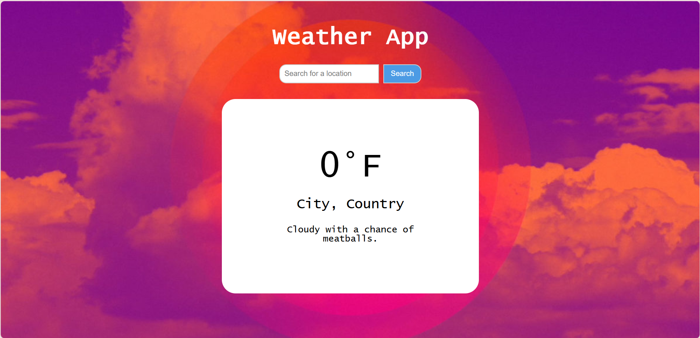

# WeatherApp
weather app created for spring 2025 advanced web design project 1  
project requirements listed on the odin project webpage:  
https://www.theodinproject.com/lessons/node-path-javascript-weather-app 

project may be viewed by visiting the url: https://frogbeth.github.io/WeatherApp/  
or by cloning the repository code onto your local machine.

enter a city name into the search bar and press "search" to fetch your city's weather data from the visualcrossing API.  
right now, the weather data is only logged to the console in the json form, but this will be fixed.  
css styling will be edited to change depending on the searched location's weather.  

  

this project was created with JavaScript, HTML, and CSS
